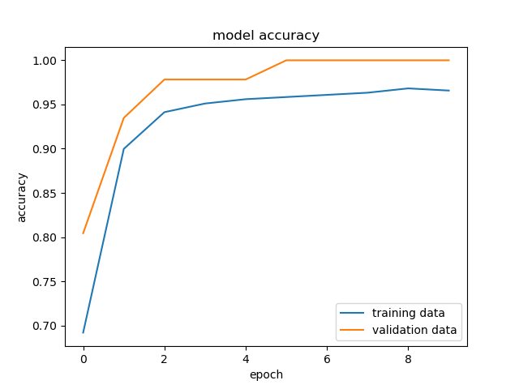

# Breast Cancer Classification

## Overview

The project's goal is to develop a model that can classify breast cancer as malignant or benign using medical imaging data. The purpose is to help with the early detection and diagnosis of breast cancer.

## Table of Contents

-   [Overview](#overview)
-   [Dataset](#dataset)
-   [Requirements](#requirements)
-   [Installation](#installation)
-   [Usage](#usage)
-   [Model](#model)
-   [Results](#results)
-   [Contributing](#contributing)
-   [License](#license)
-   [Acknowledgements](#acknowledgements)

## Dataset

The Breast Cancer Wisconsin (Diagnostic) dataset is used in this project. It contains 569 instances of tumors, with 30 features computed from a digitized image of a fine needle aspirate (FNA) of a breast mass.

-   Features: 30 numeric features
-   Instances: 569
-   Classes: 2 (malignant and benign)

## Requirements

-   Python 3.7+
-   NumPy
-   Pandas
-   scikit-learn
-   TensorFlow
-   Matplotlib

## Installation

1. Clone the repository:

    ```sh
    git clone https://github.com/cafesuada24/DL-Breast-Cancer-Classification
    cd DL-Breast-Cancer-Classification
    ```

2. Install the required packages:
    ```sh
    pip install -r requirements.txt
    ```

## Usage

-   Train the model:

    ```sh
    python BreastCancerClassification.py -t csv/dataset [-o path/to/save]
    ```

-   Predict the classification of new data:
    ```sh
    python predict.py -f csv/file [-o csv/output]
    ```

## Model

The model used in this project is a neural network built with TensorFlow. It consists of several dense layers with ReLU activation functions and a final output layer with a sigmoid activation function. The model is trained to minimize binary cross-entropy loss and optimized using the Adam optimizer.

## Results

The model achieves an accuracy of 98% on the test dataset. Below is the confusion matrix and classification report:




## Contributing

Contributions are welcome! Please open an issue or submit a pull request.

## License

This project is licensed under the MIT License. See the [LICENSE](LICENSE) file for details.

## Acknowledgements

-   [UCI Machine Learning Repository](<https://archive.ics.uci.edu/ml/datasets/Breast+Cancer+Wisconsin+(Diagnostic)>) for providing the dataset.
-   [TensorFlow](https://www.tensorflow.org) for the machine learning framework.
